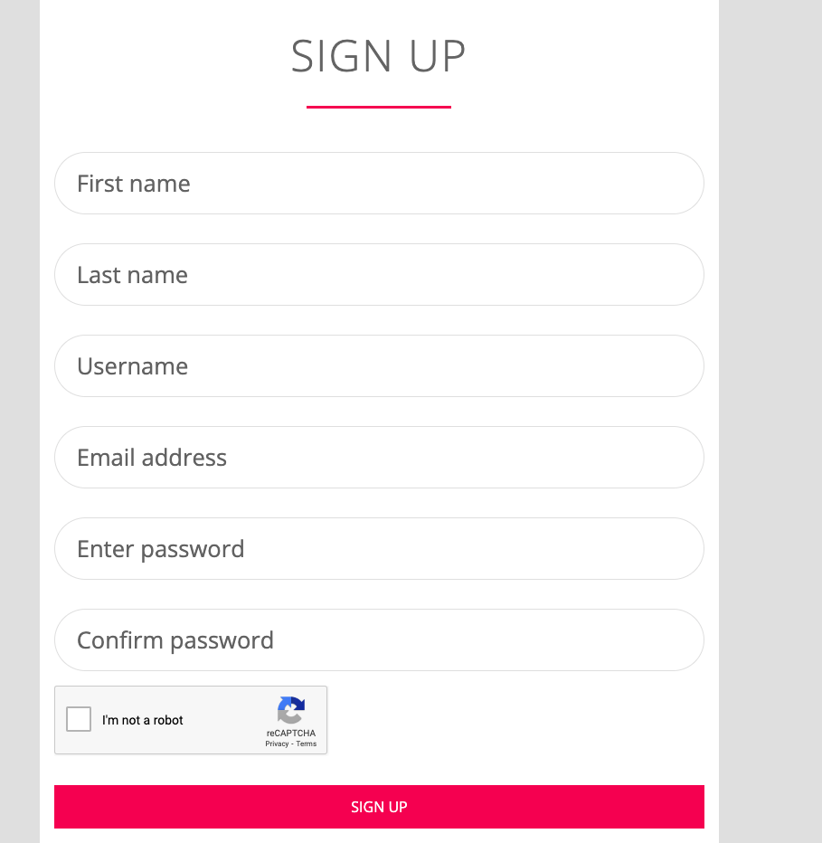

# PHP Login System with reCAPTCHA

<!-- Image -->

[]()


## Prerequisites
Before running this project, make sure you have Node.js installed on your system.

## Installation

```bash
npm init 
npm install
npm install sass 
npm install postcss postcss-cli cssnano --save-dev 
npm install terser --save-dev 
npm install chokidar-cli --save-dev 
npm install concurrently --save-dev 
```

## Running the project
```bash
npm run format
npm run watch
npm run build 
```

```
docker-compose up 
```
or
```
docker-compose up -d
```

```
docker-compose down
```

## After making changes in docker-compose.yml or Dockerfile, rebuild and restart your Docker containers:
  
  ``` 
  docker-compose down
  docker-compose up --build -d
  ```
  
  ## コンテナ内で Composer のインストールを確認する方法

  コンテナ内に入る
  起動した PHP/Apache コンテナ（php-apache）にアクセスするため、次のコマンドを実行

  ```
  docker exec -it php-apache bash
  ```

Composer のバージョンを確認する
コンテナ内で以下のコマンドを実行して Composer がインストールされているか確認

  ```
    composer --version
  ```

    コンテナから退出する
  ```
  exit
  ```
    確認が終わったら、exit コマンドでコンテナから退出できます。


## PHP mysqli install 
```
docker exec -it php-apache bash
docker-php-ext-install mysqli
exit
```

## php dot env install
```
docker exec -it php-apache bash
composer require vlucas/phpdotenv
exit
```

## php mailer install
```
docker exec -it php-apache bash
composer require phpmailer/phpmailer
exit
```

## PHPMyAdmin 
user: root
Pass: root_password
    